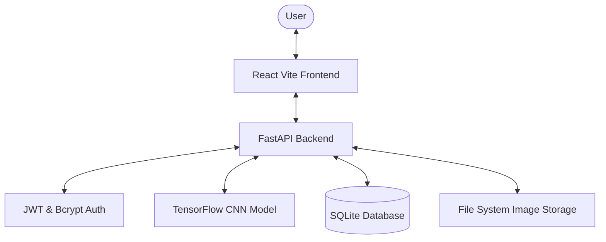

# 🌿 EcoReward: Gamified Trash Platform

EcoReward is a modern web application designed to incentivize proper waste disposal through gamification. Users can upload images of their disposed trash, which are then verified by a Convolutional Neural Network (CNN) AI model. Successful verification awards points that can be redeemed for rewards or withdrawn as real currency (INR).

---

## 🚀 Tech Stack

### Frontend
- **React.js (18)**: UI component library
- **Vite**: Ultra-fast build tool and dev server
- **Tailwind CSS**: Utility-first styling for premium design
- **React Router DOM**: Client-side routing
- **Axios**: HTTP client for API communication
- **Lucide React**: Modern iconography

### Backend
- **FastAPI**: High-performance Python web framework
- **SQLAlchemy**: Database ORM for cross-compatibility
- **SQLite**: Local relational database
- **Pydantic**: Robust data validation and serialization
- **Bcrypt & JWT**: Secure password hashing and stateless authentication
- **TensorFlow**: AI engine for image classification

---

## ✨ Key Features
- **AI Image Verification**: Instant verification of proper trash disposal using a trained CNN model.
- **Dynamic Dashboard**: Real-time tracking of points, approved uploads, and rejection history.
- **Reward Marketplace**: Browse and redeem physical or digital rewards using earned points.
- **Cash Withdrawal**: Convert points directly to Indian Rupees (₹) with multiple payment methods (UPI, PayPal, Bank Transfer).
- **Secure Authentication**: Protected routes with industry-standard JWT and encrypted password storage.

---

## 🛠️ Installation & Setup

### Prerequisites
- Python 3.10+
- Node.js 18+
- Git

### Backend Setup
1. Navigate to the backend directory:
   ```powershell
   cd backend
   ```
2. Create and activate a virtual environment:
   ```powershell
   python -m venv venv
   .\venv\Scripts\Activate.ps1
   ```
3. Install dependencies:
   ```powershell
   pip install -r requirements.txt
   ```
4. Set up environment variables:
   Copy `.env.example` to `.env` and configure accordingly.

### Frontend Setup
1. Navigate to the frontend directory:
   ```powershell
   cd frontend
   ```
2. Install dependencies:
   ```powershell
   npm install
   ```

---

## 🏃 Run Commands

### Start Backend
```powershell
cd backend
.\venv\Scripts\Activate.ps1
uvicorn app.main:app --port 8000 --reload
```

### Start Frontend
```powershell
cd frontend
npm run dev
```

---

## 🖼️ Screenshots

| https://drive.google.com/drive/folders/1wPSu32a2wQTHWvyCE8FyDPrfeOEt-QFl

---

## 🎬 Demo Video
| https://drive.google.com/drive/folders/1wPSu32a2wQTHWvyCE8FyDPrfeOEt-QFl

---

## 🏗️ Architecture Diagram



---

## 📖 API Documentation
Once the backend is running, you can access the interactive API documentation at:
- **Swagger UI**
- **ReDoc**

---

## 👥 Team Members
- **Namratha Suresh**
- **Nakshathra L**
